<picture>
  <source media="(prefers-color-scheme: dark)" srcset="./dark.svg">
  <source media="(prefers-color-scheme: light)" srcset="./light.svg">
  
</picture>

## Hi, I'm Brian7HC

I'm a computer scientist with a strong interest in cybersecurity. I like understanding how systems work, and then how they fail.

## Focus

- Cybersecurity
- Computer science

## Languages

`C` · `C#` · `Python` · `Rust` · `Dart` · `HTML5` · `JavaScript` · `Shell` · `Java`
